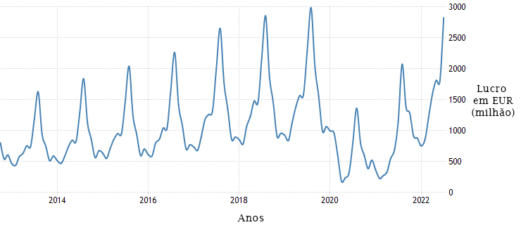
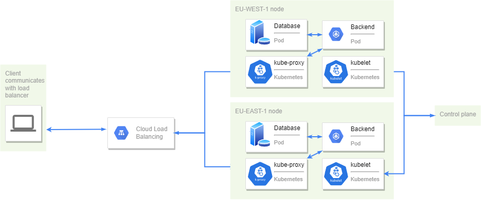
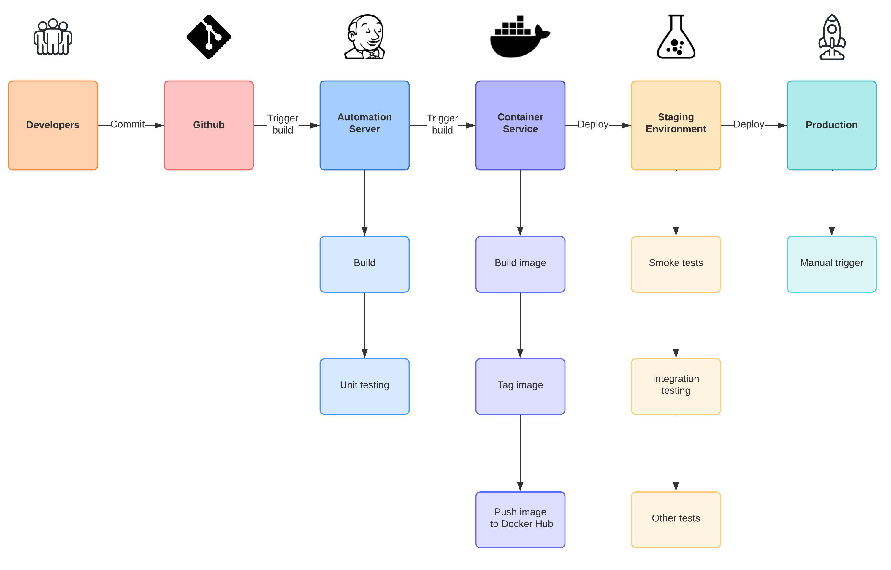
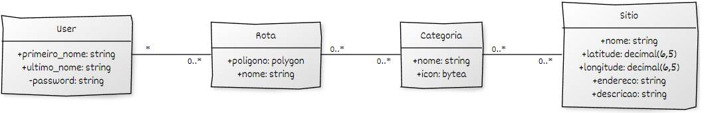
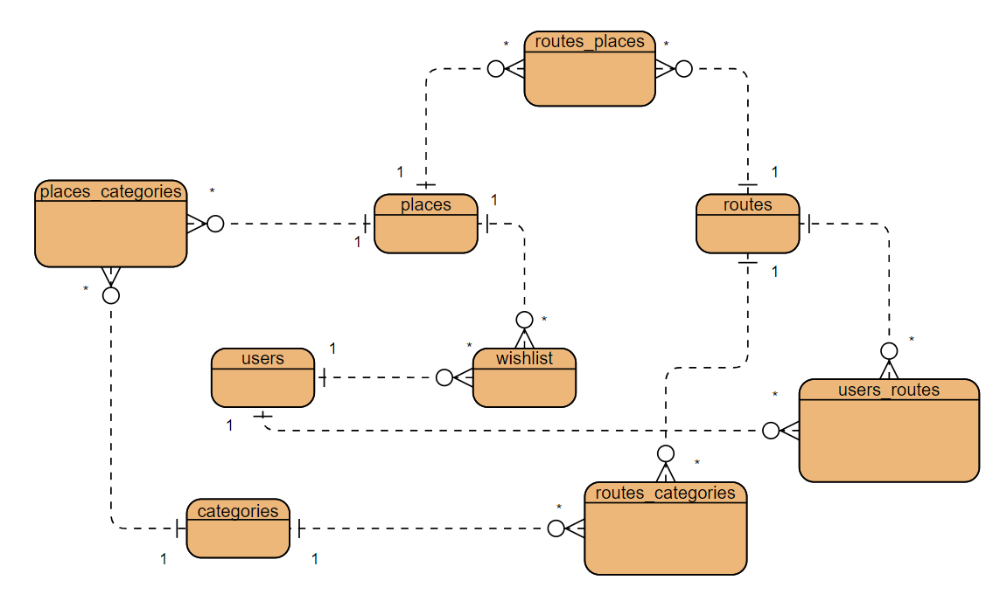

# Meet Lisbon

Afonso Goulart (20211056), Maria Martins (20211010) e Mário Nascimento (20210387)

<!-- TABLE OF CONTENTS -->
# Índice

* [Introdução](#introdução)
* [Objetivos](#objetivos)
* [Pesquisa](#pesquisa)
* [Benchmarking de mercado](#benchmarking-de-mercado)
* [Guiões de teste](#guiões-de-teste)
* [Descrição genérica da solução a implementar](#descrição-genérica-da-solução-a-implementar)
* [Requisitos Técnicos para desenvolvimento do projeto](#requisitos-técnicos-para-desenvolvimento-do-projeto)
* [Arquitetura da Solução](#arquitetura-da-solução)
* [Modelo de Domínio](#modelo-de-domínio)
* [Tecnologias a utilizar](#tecnologias-a-utilizar)
* [Gráfico de Gantt](#gráfico-de-gantt)
* [Documentação REST](#documentação-rest)
* [Manual de Utilizador](#manual-de-utilizador)
* [Guia de Dados](#guia-de-dados)
* [Dicionário de Dados](#dicionário-de-dados)
* [Modelos e Diagramas](#modelos-e-diagramas)
* [Referências Bibliográficas](#referências-bibliográficas)
* [License](#license)
* [Anexos](#anexos)

# Introdução
De modo a criar uma aplicação divertida e útil pensámos numa aplicação que pudesse vir a ajudar os turistas a conhecer a nossa cidade, Lisboa. A nossa aplicação tem então como público-alvo os turistas, podendo, no entanto, servir também para portugueses à procura de conhecer melhor o seu próprio pais.
Explicando um pouco mais profundamente a essência da nossa aplicação, Meet Lisbon irá ser utilizada para podermos espalhar um pouco da nossa história com quem não a conhece.
Através da aplicação, abrindo a câmara, o utilizador poderá fotografar um ponto turístico e o mesmo será reconhecido utilizando técnicas de inteligência artificial, como por exemplo Template Matching, mostrando depois vários factos históricos e alguns factos interessantes.  Outro uso possível da aplicação será a pesquisa de pontos turísticos, podendo adicioná-los a uma *wishlist*.

# Objetivos
Com a criação da nossa aplicação definimos vários objetivos, passando estes por proporcionar aos turistas uma viagem onde possam aprender a história e cultura do nosso país, queremos possibilitar uma viagem tranquila e facilitada uma vez que podem utilizar a nossa aplicação para procurar vários pontos turísticos e conhecer a sua história em apenas uma ferramenta. 
Um dos nossos objetivos é também facilitar o fluxo de informação podendo utilizar a nossa aplicação em vez de ter de ocupar memória, tempo e recursos no dispositivo móvel com o que se calhar teriam de ser várias aplicações diferentes.

# Pesquisa
Para podermos construir uma aplicação o mais fidedigna possível fizemos várias pesquisas sobre a área do turismo. Entre estas pesquisas verificámos o crescimento do turismo em Portugal para podermos ter a certeza que esta aplicação seria de facto utilizada e não apenas mais uma aplicação sem grande uso na App Store. No gráfico da Fig. 1 verifica-se um padrão de crescimento ao longo dos anos, tendo descido naturalmente em 2020 e esperando atingir os valores mais altos até hoje em 2023.

|  | 
|:-:| 
| *Fig. 1* - Lucro de turismo por ano em milhões de euros, em Portugal |

Queremos então aproveitar esta onda de crescimento do turismo para lançar a aplicação e ajudar todos os interessados a conhecer a nossa cidade.de

# Benchmarking de mercado
De modo a podermos diferenciar-nos de muitos outros, fizemos pesquisas sobre as aplicações já existentes neste mercado para perceber quais os aspetos que têm de ser melhorados nesta área aplicativa. 
Encontrámos várias aplicações e vamos falar um pouco das suas características:
  * **Lisboa Cool** - encontra informação detalhada sobre os eventos do momento e os locais mais “cool” da capital portuguesa;
  * **Citymapper** - nesta aplicação não só encontra informação sobre todos os transportes disponíveis em Lisboa, como também lhe são fornecidos os melhores trajetos para o seu destino;
  * **Fever** - centenas de sugestões à espera das mais diversas áreas, como cinema e teatro, restaurantes, festas ou programas de bem-estar;
  * **Lisbon Street Art** - dá a conhecer (quase) toda a street art da capital e arredores;
  * **Lisbon Travel Guide** - pode planear percursos, de acordo com os mapas que são disponibilizados;  
  
Como podemos ver existem várias aplicações para diferentes usos, mas nenhuma que consiga reconhecer um ponto turístico a partir da câmara e contar um pouco sobre a sua história, e é por essa razão que achamos o nosso projeto útil e interessante.

# Guiões de teste
Guião 1 (objecto *core* do projeto) - Um turista está a andar pelas ruas de Lisboa e depara-se com o Padrão dos Descobrimentos, ganha curiosidade pelo monumento e abre a aplicação que tem no telemóvel: "Meet Lisbon". Assim que abre a aplicação, carrega no ícone da câmara, tira uma fotografia ao monumento conseguindo assim ler sobre este, perceber a sua história e até ler alguns *fun facts*.

Guião 2 (utilização diferente do *core* do projeto) - Um português que vive no Porto sabe que irá visitar Lisboa nas férias e instala a aplicação "Meet Lisbon" de modo a poder ter um auxílio de viagem. Num dia está a preparar a viagem e vai utilizar a aplicação para poder ver quais os monumentos e pontos turísticos que tem interesse. O senhor abre a aplicação e vai ao ícone do mapa para poder ver quais os monumentos disponíveis no leque da aplicação e ver o quão perto uns dos outros estes se situam para ver o tempo que demora de viagem de uns para os outros e planear assim o seu dia.

Guião 3 (utilização diferente do *core* do projeto) - Durante a sua viagem a Lisboa, um turista abre a aplicação "Meet Lisbon" de modo a ver quais os sítios que já visitou e quais os sítios que falta visitar, para isso carrega no ícone com um coração para poder ver a *wishlist* que fez em casa com todos os pontos de interesse.

# Descrição genérica da solução a implementar
Como descrevemos na introdução, a nossa aplicação passa por ajudar os turistas a conhecer melhor a capital portuguesa. Este projeto inclui vários aspectos como o uso da câmara fotográfica de modo a poder haver um reconhecimento do ponto turistico por parte do software, irá incluir localização geográfica pois teremos um mapa virtual com os todos os pontos turísticos para os utilizadores poderem adicionar à *wishlist* e criar uma rota de viagem, entre outros aspectos.

# Enquadramento nas diversas Unidades Curriculares
Sendo este um projeto multidisciplinar, arranjámos maneira de incluir todas as cadeiras na idealização da nossa aplicação:

  * **Bases de Dados** - Utilizaremos bases de dados para armazenamento, busca e manipulação de informação sobre os utilizadores, as suas preferências, monumentos e outros dados pertinentes que requerem permanência;
  * **Programação Orientada a Objetos** - Vamos utilizar uma backend RESTful API feita numa linguagem maioritariamente orientada a objetos (java), com o objetivo de servir de centro de controlo. Este servidor servirá como intermediário entre a aplicação móvel (frontend) e a base de dados e será também a aplicação que vai receber os pedidos e enviar as respostas adequadas;
  * **Programação de Dispositivos Móveis** - Será feita uma aplicação móvel que funcionará como a frontend do projeto. O utilizador usará esta app para interagir com os recursos disponibilizados pela backend, base de dados e outros serviços. A nossa aplicação terá um GUI através do qual os utilizadores poderão fazer esta interação.
  * **Competências Comunicacionais** - Iremos utilizar as competências aprendidas em aula de modo a melhorarmos as nossas apresentações orais de entrega a entrega;

# Requisitos Técnicos para desenvolvimento do projeto
Para o desenvolvimento deste projeto, será necessária a aprendizagem e utilização de várias línguagens de programação e outras plataformas:
  * **Linguagem Java** -> Para desenvolvimento em Spring Boot da backend API e da aplicação Android;
  * **Linguagem SQL** -> Para uso e configuração da base de dados;
  * Programação móvel;
  * Orquestração e coordenação de containers para criação do cluster;
  * Automatização de testes e integração/distribuição contínuas;
  * Funcionamento e programação de algoritmos para análise de imagens -> trabalhar com a biblioteca OpenCV;

# Arquitetura da Solução
A nossa aplicação, embora pequena, requer uma coordenação entre vários equipamentos e tecnologias, assim como uma infraestrutura sólida e de fácil manutenção. Os diversos componentes a integrar são:  
  * Base de dados  
  * Backend API  
  * Aplicação Android

A base de dados e backend API têm de garantir uma disponibilidade alta, assim como uma latência baixa, visto que a interação com o utilizador é baseada na sua localização e movimentação em tempo real. Por outro lado, no inicio poderá ser mais vantajoso dar prioridade à simplicidade e organização dado que as necessidades iniciais serão baixas. Para tal, optamos por uma infraestrutura de single cluster com load balancing. A orquestração das diversas componentes da backend api e base de dados será feita pelo Kubernetes, como demonstrado na Fig. 2.  
|  | 
|:--:| 
| *Fig. 2* - Diagrama de rede |

A base de dados e a backend api correm em containers individuais dentro de pods. Estes pods correm indefinidamente em worker nodes. Estes comunicam com a rede externa através do `kube-proxy`. A manutenção, monitorização e orquestração são organizadas pelo `control plane`. A `kubelet`, presente em todos os pods, tem como objetivo comunicar com o `control plane`. O plano é utilizar Google Kubernetes Engine (GKE) para gerir o cluster.

## Armazenamento permanente
Utilizaremos uma base de dados, PostreSQL. Este servidor não terá comunicação com o exterior, interagindo apenas com a backend. Desta forma aumenta-se a segurança da nossa aplicação, reduzindo os vetores de ataque expostos.

## Backend API
O servidor backend será feito utilizando Spring Boot numa arquitetura REST. Esta servirá para receber requests da frontend, processá-los e devolver uma resposta. A comunicação com a base de dados e eventualmente com outros recursos internos (ou, possívelmente, externos) será feita pela backend quando necessária. 

## Aplicação Android
Esta aplicação terá a função de frontend. O seu objetivo será possibilitar uma interação com os utilizadores através da sua interface grafica e a comunicação com a backend, intermediando o utilizador e os recursos internos.
 
## Integração e distribuição
Para limitar o número de erros humanos é vantajoso automatizar a maior parte dos passos, especialmente aqueles mais extensos e que se repetem. Planeamos então utilizar Github Actions e, possívelmente, algumas plataformas como `Jenkins` para facilitar estas tarefas. Assim, a ideia geral da pipeline para integração e distribuição contínuas está representada na Fig. 3.
 
|  | 
|:-:| 
| *Fig. 3* - CI/CD pipeline |
  
# Modelo de Domínio

|  | 
|:-:| 
| *Fig. 4* - Modelo de Domínio |

# Tecnologias a utilizar

Fora as tecnologias descritas no enquadramento das Unidades Curriculares, iremos utilizar também:
  * [Spring Boot](https://spring.io/projects/spring-boot) - Para RESTFul backend api
  * [PostgreSQL](https://www.postgresql.org/) - Para a base de dados
  * [OpenCV](https://www.postgresql.org/) - Biblioteca de funções auxiliares a reconhecimento de imagem
  * [Docker](https://www.docker.com/) - Conjunto de ferramentas que possibilitam a virtualização e manutenção de instâncias
  * [Kubernetes](https://kubernetes.io/) - Criação, monitorização, orquestração e scaling do cluster 
  * [Jenkins](https://www.jenkins.io/) - Servidor de automatização para integração e distribuição contínuas 

# Gráfico de Gantt

|  | 
|:-:| 
| *Fig. 5* - Calendarização - Gráfico de Gantt |

A calendarização está dividida em três, sendo a primeira parte referente à Base de Dados, a segunda referente à Backend e a última referente à app.

# Documentação REST

Ver a documentação REST [aqui](https://github.com/Meet-Lisbon/documents/blob/main/G01-documenta%C3%A7%C3%A3o-REST.pdf).

# Manual de Utilizador

Ver o manual de utilizador [aqui]().

# Guia de Dados

Ver o guia de dados [aqui](https://github.com/Meet-Lisbon/documents/blob/main/G01-guia-de-dados.pdf).

# Dicionário de Dados
Ver o dicionário de dados [aqui](https://github.com/Meet-Lisbon/documents/blob/main/Dicion%C3%A1rioDados-G01.pdf).

# Modelos e Diagramas
Para ter acesso ao todos Modelo Entidade-Relação e ao Diagrama de Classes da nossa aplicação, ir aos anexos.

# Referências Bibliográficas

  
Costa, J. S. L. (n.d.). <i>A Procura Turística em Portugal: Evolução Recente</i>. 85.

  
  
<i>O que fazer em Lisboa: As apps que o vão ajudar</i>. (2019, April 17). Moving to Portugal. <a href="https://www.movingtoportugal.pt/lazer/o-que-fazer-em-lisboa/">https://www.movingtoportugal.pt/lazer/o-que-fazer-em-lisboa/</a>

  
  
<i>Portugal Tourism Revenues—September 2022 Data—1996-2021 Historical</i>. (n.d.). Retrieved October 7, 2022, from <a href="https://tradingeconomics.com/portugal/tourism-revenues">https://tradingeconomics.com/portugal/tourism-revenues</a>

  
  
<i>Portugal’s Travel &amp; Tourism could surpass pre-pandemic levels in 2023</i>. (n.d.). 3.

  
  
Rodrigues, N. (2019, March 7). <i>As melhores apps para descobrir Lisboa</i>. Lisboa Secreta. <a href="https://lisboasecreta.co/as-melhores-apps-para-descobrir-lisboa/">https://lisboasecreta.co/as-melhores-apps-para-descobrir-lisboa/</a>

  
  
T: +351 210 312 700, F: +351 210 312 899, Atl@visitlisboa.com, &amp; Www.visitlisboa.com. (n.d.). <i>Lisboa OFFICIAL Site</i>. Turismo de Lisboa. Retrieved October 7, 2022, from <a href="https://www.visitlisboa.com/pt-pt">https://www.visitlisboa.com/pt-pt</a>

  

# License
<a href="https://github.com/Meet-Lisbon/core/blob/main/LICENSE"> GNU General Public License v3.0 </a>

## Anexos 

# Modelo Entidade-Relação (MER)
|  | 

# Diagrama de Classes