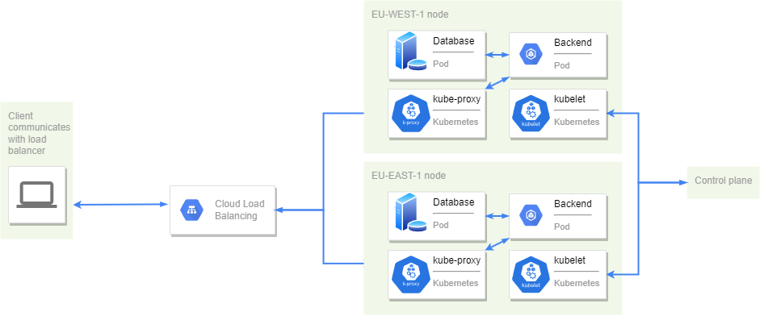
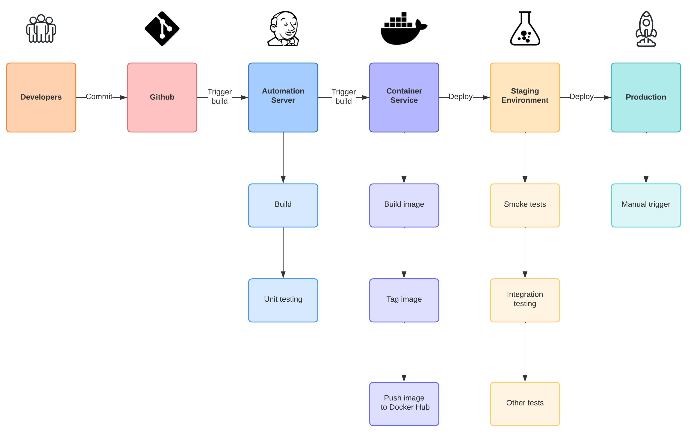

# Relatório

Afonso Goulart (20211056), Maria Martins (20211010) e Mário Nascimento (20210387)

<!-- TABLE OF CONTENTS -->
# Índice

* 🟢 [Introdução](#introdução)
* 🟢 [Objetivos](#objetivos)
* 🟢 [Pesquisa](#pesquisa)
* 🟢 [Benchmarking de mercado](#benchmarking-de-mercado)
* 🟢 [Guiões de teste](#guiões-de-teste)
* 🔴 [Descrição genérica da solução a implementar](#descrição-genérica-da-solução-a-implementar)
* 🟢 [Arquitetura da Solução](#arquitetura-da-solução)
* 🔴 [Modelo de Domínio](#modelo-de-domínio)
* 🟢 [Tecnologias a utilizar](#tecnologias-a-utilizar)
* 🔴 [Gráfico de Gantt](#gráfico-de-gantt)
* 🟢 [Referências Bibliográficas](#referências-bibliográficas)
* 🟢 [License](#license)

# Introdução
De modo a criar uma aplicação divertida e útil pensámos numa aplicação que pudesse vir a ajudar os turistas a conhecer a nossa cidade, Lisboa. A nossa aplicação tem então como público-alvo os turistas, podendo, no entanto, servir também para portugueses à procura de conhecer melhor o seu próprio pais.
Explicando um pouco mais profundamente a essência da nossa aplicação, Meet Lisbon irá ser utilizada para podermos espalhar um pouco da nossa história com quem não a conhece.
Através da aplicação, abrindo a câmara, o utilizador poderá fotografar um ponto turístico e o mesmo será reconhecido utilizando técnicas de inteligência artificial, como por exemplo Template Matching, mostrando depois vários factos históricos e alguns factos interessantes.  Outro uso possível da aplicação será a pesquisa de pontos turísticos, podendo adicioná-los a uma *wishlist*.

# Objetivos
Com a criação da nossa aplicação definimos vários objetivos, passando estes por proporcionar aos turistas uma viagem onde possam aprender a história e cultura do nosso país, queremos possibilitar uma viagem tranquila e facilitada uma vez que podem utilizar a nossa aplicação para procurar vários pontos turísticos e conhecer a sua história em apenas uma ferramenta. 
Um dos nossos objetivos é também facilitar o fluxo de informação podendo utilizar a nossa aplicação em vez de ter de ocupar memória, tempo e recursos no dispositivo móvel com o que se calhar teriam de ser várias aplicações diferentes.

# Pesquisa
Para podermos construir uma aplicação o mais fidedigna possível fizemos várias pesquisas sobre a área do turismo. Entre estas pesquisas verificámos o crescimento do turismo em Portugal para podermos ter a certeza que esta aplicação seria de facto utilizada e não apenas mais uma aplicação sem grande uso na App Store. No gráfico da Fig. 1 verifica-se um padrão de crescimento ao longo dos anos, tendo descido naturalmente em 2020 e esperando atingir os valores mais altos até hoje em 2023.

|  | 
|:-:| 
| *Fig. 1* - Lucro de turismo por ano em milhões de euros |

# Benchmarking de mercado
De modo a podermos diferenciar-nos de muitos outros, fizemos pesquisas sobre as aplicações já existentes neste mercado para perceber quais os aspetos que têm de ser melhorados nesta área aplicativa. 
Encontrámos várias aplicações e vamos falar um pouco das suas características:
  * **Lisboa Cool** - encontra informação detalhada sobre os eventos do momento e os locais mais “cool” da capital portuguesa;
  * **Citymapper** - nesta aplicação não só encontra informação sobre todos os transportes disponíveis em Lisboa, como também lhe são fornecidos os melhores trajetos para o seu destino;
  * **Fever** - centenas de sugestões à espera das mais diversas áreas, como cinema e teatro, restaurantes, festas ou programas de bem-estar;
  * **Lisbon Street Art** - dá a conhecer (quase) toda a street art da capital e arredores;
  * **Lisbon Travel Guide** - pode planear percursos, de acordo com os mapas que são disponibilizados;  
  
Como podemos ver existem várias aplicações para diferentes usos, mas nenhuma que consiga reconhecer um ponto turístico a partir da câmara e contar um pouco sobre a sua história, e é por essa razão que achamos o nosso projeto útil e interessante.

# Guiões de teste
Guião 1 (objecto *core* do projeto) - Um turista está a andar pelas ruas de Lisboa e depara-se com o Padrão dos Descobrimentos, ganha curiusidade pelo monumento e abre a aplicação que tem no telemóvel: "Meet Lisbon". Assim que abre a aplicação, carrega no ícone da câmara, tira uma fotografia ao monumento conseguindo assim ler sobre este, perceber a sua história e até ler alguns *fun facts*.

Guião 2 (utilização diferente do *core* do projeto) - Um português que vive no Porto sabe que irá visitar Lisboa nas férias e instala a aplicação "Meet Lisbon" de modo a poder ter um auxilio de viagem. Num dia está a preparar a viagem e vai utilizar a aplicação para poder ver quais os monumentos e pontos turisticos que tem interesse. O senhor abre a aplicação e vai ao ícone do mapa para poder ver quais os monumentos disponíveis no leque da aplicação e ver o quão perto uns dos outros estes se situam para ver o tempo que demora de viagem de uns para os outros e planear assim o seu dia.

Guião 3 (utilização diferente do *core* do projeto) - Durante a sua viagem a Lisboa, um turista abre a aplicação "Meet Lisbon" de modo a ver quais os sítios que já visitou e quais os sítios que falta visitar, para isso carrega no ícone com um coração para poder ver a *wishlist* que fez em casa com todos os pontos de interesse.

# Descrição genérica da solução a implementar

# Enquadramento nas diversas Unidades Curriculares
Sendo este um projeto multidisciplinar, arranjámos maneira de incluir todas as cadeiras na idealização da nossa aplicação:

  * **Bases de Dados** - Utilizaremos bases de dados para armanezamento, busca e manipulação de informação sobre os utilizadores, as suas preferências, monumentos e outros dados pertinentesn que requerem permanência;
  * **Programação Orientada a Objetos** - Vamos utilizar uma backend RESTful API feita numa línguagem maioritáriamente orientada a objetos (java), com o objetivo de servir de centro de controlo. Este servidor servirá como intermediário entre a aplicação móvel (frontend) e a base de dados e será também a aplicação que vai receber os pedidos e enviar as respostas adequadas;
  * **Programação de Dispositivos Móveis** - Será feita uma aplicação móvel que funcionará como a frontend do projeto. O utilizador usará esta app para interagir com os recursos disponibilizados pela backend, base de dados e outros serviços. A nossa aplicação terá um GUI através do qual os utilizadores poderão fazer esta interação.
  * **Competências Comunicacionais** - Iremos utilizar as competências aprendidas em aula de modo a melhorarmos as nossas apresentações orais de entrega a entrega;
  * **Matemática Discreta** - Para manipulação e reconhecimento de imagens usaremos algorítmos e estratégias que se enquadram na cadeira de matemática discreta, como por exemplo `Algorítmo de Dijkstra` para computação de caminhos, `TM_SQDIFF` ou `TM_CCOEFF` para template matching, entre outros.

# Requisitos Técnicos para desenvolvimento do projeto

# Arquitetura da Solução
A nossa aplicação, embora pequena, requer uma coordenação entre vários equipamentos e tecnologias, assim como uma infraestrutura sólida e de fácil manutenção. Os diversos componentes a integrar são:  
  * Base de dados  
  * Backend API  
  * Aplicação Android

A base de dados e backend API têm de garantir uma disponibilidade alta, assim como uma latência baixa, visto que a interação com o útilizador é baseada na sua localização e movimentação em tempo real. Por outro lado, no ínicio poderá ser mais vantajoso dar prioridade à simplicidade e organização dado que as necessidades iniciais serão baixas. Para tal, optamos por uma infra-estrutura de single cluster com load balancing. A orquestração das diversas componentes da backend api e base de dados será feita pelo Kubernetes, como demonstrado na Fig. 2.  
|  | 
|:--:| 
| *Fig. 2* - Diagrama de rede |

A base de dados e a backend api correm em containers individuaís dentro de pods. Estes pods correm indefinidamente em worker nodes. Estes comunicam com a rede externa através do `kube-proxy`. A manutenção, monitorização e orquestração são organizadas pelo `control plane`. A `kubelet`, presente em todos os pods, tem como objetivo comunicar com o `control plane`. O plano é utilizar Google Kubernetes Engine (GKE) para gerir o cluster.

## Armazenamento permanente
Utilizaremos uma base de dados, PostreSQL. Este servidor não terá comunicação com o exterior, interagindo apenas com a backend. Desta forma aumenta-se a segurança da nossa aplicação, reduzindo os vetores de ataque expostos.

## Backend API
O servidor backend será feito utilizando Spring Boot numa arquitetura REST. Esta servirá para receber requests da frontend, processá-los e devolver uma resposta. A comunicação com a base de dados e eventualmente com outros recursos internos (ou, possívelmente, externos) será feita pela backend quando necessária. 

## Load balancer
Os utilizadores (na verdade, a frontend) não comunica diretamente com os worker nodes do nosso cluster. Para garantir uma boa disponibilidade e rapidez geral, o load balancer é responsável por encaminhar os pedidos para os nodes que fazem mais sentido, tendo em conta dados como a proximidade ao utilizador e a carga atual sobre os servidores.  

## Aplicação Android
Esta aplicação terá a função de frontend. O seu objetivo será possibilitar uma interação com os utilizadores através da sua interface grafica e a comunicação com a backend, intermediando o utilizador e os recursos internos.
 
## Integração e distribuição
Para limitar o número de erros humanos é vantajoso automatizar a maior parte dos espaços, especialmente aqueles mais extensos e que se repetem. Planeamos então utilizar Github Actions e, possívelmente, algumas plataformas como `Jenkins` para facilitar estas tarefas. Assim, a ideia geral da pipeline para integração e distribuição contínuas está representada na Fig. 3.
 
|  | 
|:-:| 
| *Fig. 3* - CI/CD pipeline |
 

# Modelo de Domínio

# Tecnologias a utilizar

Fora as tecnologias descritas no enquandramento das Unidades Curriculares, iremos utilizar também:
  * [Spring Boot](https://spring.io/projects/spring-boot) - Para RESTFul backend api
  * [PostgreSQL](https://www.postgresql.org/) - Para a base de dados
  * [OpenCV](https://www.postgresql.org/) - Biblioteca de funções auxiliares a reconhecimento de imagem
  * [Docker](https://www.docker.com/) - Conjunto de ferramentas que possibilitam a virtualização e manutenção de instâncias
  * [Kubernetes](https://kubernetes.io/) - Criação, monitorização, orquestração e scaling do cluster 
  * [Jenkins](https://www.jenkins.io/) - Servidor de automatização para integração e distribuição contínuas 

# Gráfico de Gantt

# Referências Bibliográficas

  
Costa, J. S. L. (n.d.). <i>A Procura Turística em Portugal: Evolução Recente</i>. 85.

  
  
<i>O que fazer em Lisboa: As apps que o vão ajudar</i>. (2019, April 17). Moving to Portugal. <a href="https://www.movingtoportugal.pt/lazer/o-que-fazer-em-lisboa/">https://www.movingtoportugal.pt/lazer/o-que-fazer-em-lisboa/</a>

  
  
<i>Portugal’s Travel &amp; Tourism could surpass pre-pandemic levels in 2023</i>. (n.d.). 3.

  
  
Rodrigues, N. (2019, March 7). <i>As melhores apps para descobrir Lisboa</i>. Lisboa Secreta. <a href="https://lisboasecreta.co/as-melhores-apps-para-descobrir-lisboa/">https://lisboasecreta.co/as-melhores-apps-para-descobrir-lisboa/</a>

  
  
T: +351 210 312 700, F: +351 210 312 899, Atl@visitlisboa.com, &amp; Www.visitlisboa.com. (n.d.). <i>Informação Útil</i>. Turismo de Lisboa. Retrieved October 6, 2022, from <a href="https://www.visitlisboa.com/pt-pt/p/informacao-util">https://www.visitlisboa.com/pt-pt/p/informacao-util</a>

# License
<a href="https://github.com/Meet-Lisbon/core/blob/main/LICENSE"> GNU General Public License v3.0 </a>
